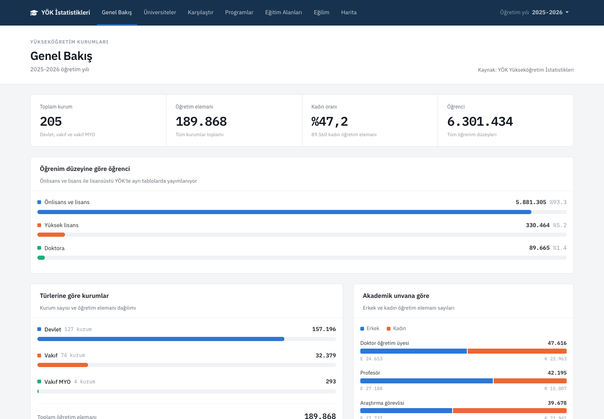
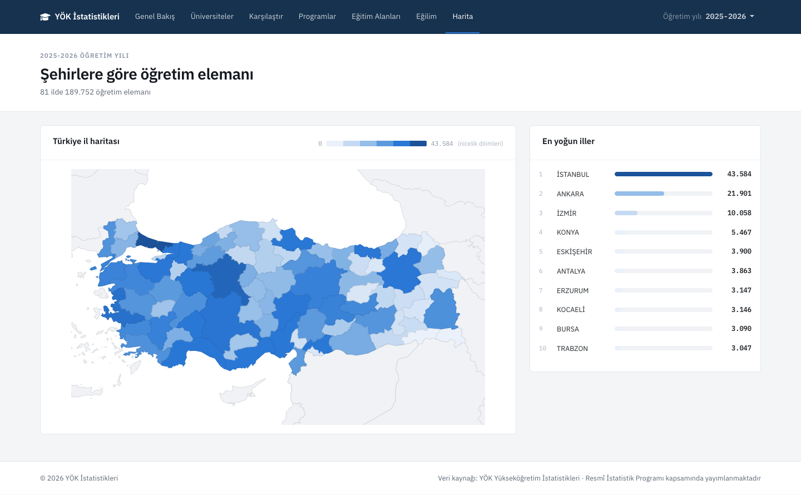
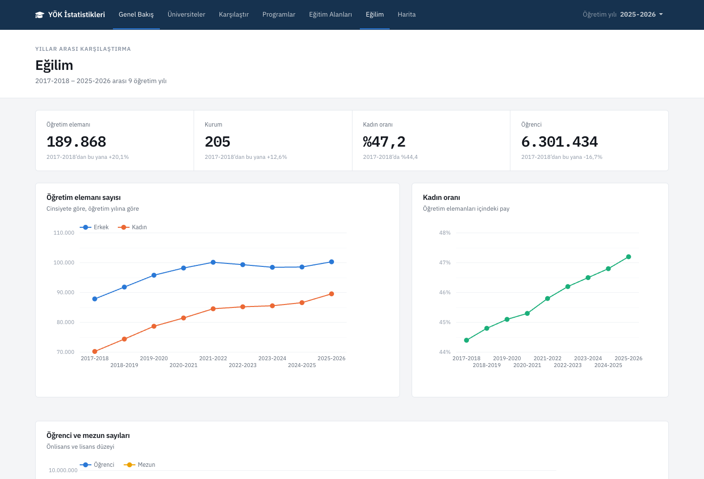
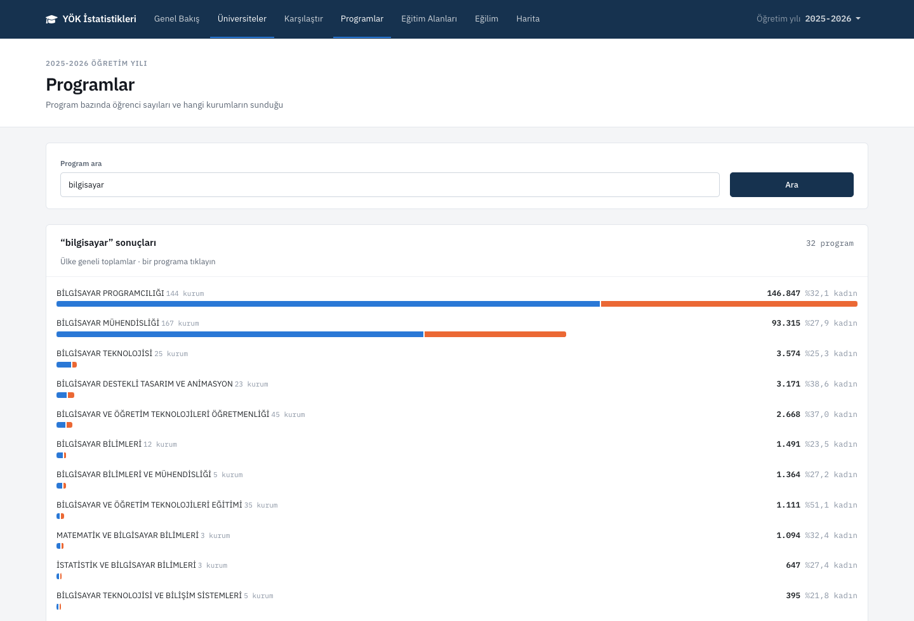
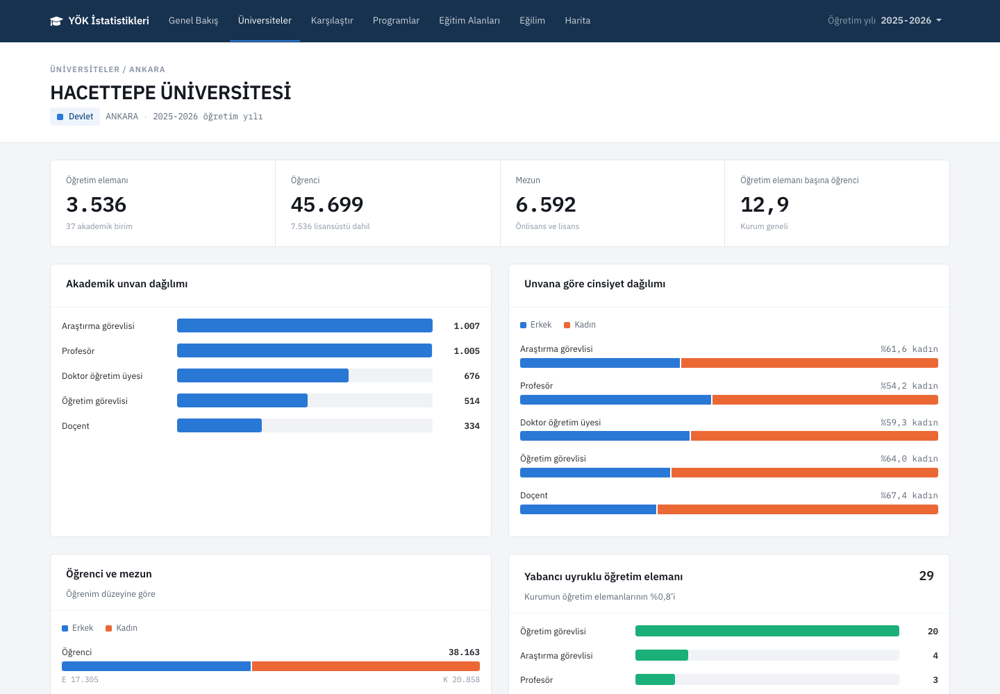

# YÖK İstatistikleri

Türkiye'deki yükseköğretim kurumlarına ait YÖK istatistiklerini toplayan,
normalize eden ve grafiklerle sunan bir web uygulaması.




Veriler [YÖK Yükseköğretim Bilgi Yönetim Sistemi](https://istatistik.yok.gov.tr)
üzerinden alınır, Excel tablolarından ayrıştırılıp doğrulanır ve MongoDB'ye
yüklenir. Uygulama **çalışma anında YÖK'e istek atmaz**; veri toplama ayrı bir
pipeline olarak çalışır, portal erişilemez olduğunda site çalışmaya devam eder.

**205 kurum · 6.301.434 öğrenci · 189.868 öğretim elemanı · 9 öğretim yılı**

---

## Neler var

| Sayfa | İçerik |
|---|---|
| **Genel bakış** | Seçilen öğretim yılının özeti: kurum, öğrenci, öğretim elemanı, kadın oranı |
| **Üniversiteler** | Şehir, tür ve ada göre filtrelenebilir kurum listesi |
| **Kurum profili** | Tek kurumun akademik unvan, cinsiyet, öğrenci, mezun ve yabancı uyruklu kırılımları |
| **Karşılaştır** | İki kurumu yan yana, aynı ölçeklerde |
| **Programlar** | 2.720 programın ülke geneli öğrenci sayıları ve hangi kurumların sunduğu |
| **Eğitim alanları** | ISCED alanlarına göre önlisans ve lisans dağılımı |
| **Eğilim** | Yıllar arası seyir: öğretim elemanı, kadın oranı, öğrenci ve mezun |
| **Harita** | Türkiye il haritası üzerinde öğretim elemanı yoğunluğu |
| **Özet tablolar** | Öğretim türü, yaş, il/ilçe ve birim türü kırılımları |

<table>
  <tr>
    <td width="50%"></td>
    <td width="50%"></td>
  </tr>
  <tr>
    <td></td>
    <td></td>
  </tr>
</table>

## Veride ne görünüyor

Öğrenci sayısı 2021-2022'den bu yana %25 düşmüş görünüyor. Kırılıma bakınca
düşüşün örgün öğretimde **olmadığı** ortaya çıkıyor:

| Öğretim türü | 2021-2022 | 2025-2026 | Değişim |
|---|---:|---:|---:|
| Örgün | 2.881.105 | 3.368.802 | **+%16,9** |
| Açıköğretim | 4.454.128 | 2.248.392 | **−%49,5** |
| İkinci öğretim | 432.348 | 200.461 | **−%53,6** |
| Uzaktan | 61.567 | 63.650 | +%3,4 |
| **Toplam** | **7.829.148** | **5.881.305** | **−%24,9** |

Önlisans + lisans düzeyi, `T007` tablosundan. Örgün öğretim 2014-2015'ten bu
yana %61,6 büyümüş; toplamdaki düşüş tamamen açıköğretim ve ikinci öğretimden
geliyor.

## Mimari

```
YÖK portalı (ZK Framework SPA)
      │  Playwright · yılda bir çalışır
      ▼
data/raw/*.xls              ham Excel      → .gitignore, repoya girmez (~260 MB)
      │  xlrd ile ayrıştırma + doğrulama
      ▼
data/processed/*.ndjson.gz  normalize veri → repoda versiyonlanır (5,7 MB)
      │  seed
      ▼
MongoDB  ←  ASP.NET Core MVC uygulaması
```

Ham Excel dosyaları repoya girmiyor; yalnızca normalize edilmiş, sıkıştırılmış
NDJSON versiyonlanıyor. Gzip çıktısı zaman damgasız üretiliyor, böylece veri
değişmediğinde git de bir değişiklik görmüyor.

Pipeline'ın ayrıntıları ve YÖK portalının neden tarayıcı otomasyonu gerektirdiği:
[`tools/yok-scraper/README.md`](tools/yok-scraper/README.md)

### Doğrulama

Her tablo ayrıştırıldıktan sonra üç ayrı kontrolden geçiyor:

- **Aritmetik** — satır toplamları kaynak dosyanın kendi toplam satırıyla karşılaştırılıyor.
- **Anlamsal** — kolon başlıkları beklenen anlamla eşleşiyor mu. YÖK 2018 öncesinde
  sekiz akademik unvan grubu yayımlıyordu (Yardımcı Doçent, Okutman, Uzman, Çevirici),
  bugün altı. Kolonlar aynı yerde durduğu için aritmetik kontrol bunu yakalayamıyor;
  başlık kontrolü dosyayı reddediyor.
- **Tekrar kaydı** — kaynakta byte düzeyinde birebir aynı satırlar olabiliyor;
  ayıklanıp raporlanıyor.

## Veri kapsamı

| Tablo | İçerik | Yıl |
|---|---|---:|
| `T028` | Öğretim elemanları — akademik görevlere göre | 9 |
| `T035` | Yabancı uyruklu öğretim elemanları | 9 |
| `T201` | Yabancı uyruklu öğretim elemanları — uyruğa göre | 8 |
| `T012` | Önlisans ve lisans öğrenci sayıları | 10 |
| `T022` | Lisansüstü öğrenci sayıları | 9 |
| `M005` | Mezun sayıları | 11 |
| `T107` | Türlerine göre akademik birim sayıları | 10 |
| `T017` | Lisans öğrenci — eğitim alanına göre | 12 |
| `T019` | Önlisans öğrenci — eğitim alanına göre | 12 |
| `T007` | Öğrenci — yaş, öğrenim düzeyi ve öğretim türü | 12 |
| `T102` | Öğrenci — il/ilçe ve öğretim türü | 12 |
| `T003` | Birim türüne göre öğrenci ve öğretim elemanı | 9 |
| `T105` | Program düzeyinde öğrenci sayıları | 1 |

En geniş kapsam 2014-2015 → 2025-2026. `T105` yılda ~1,2 MB sıkıştırılmış veri
ürettiği ve gzip git'te delta sıkışmadığı için yalnızca en güncel yıl için
işleniyor; program düzeyinde geçmiş seriye ihtiyaç yok, zaman serisi zaten
kurum düzeyinde mevcut.

Toplam: **124 koleksiyon, 50.437 belge.**

## Teknolojiler

| Katman | Teknoloji |
|---|---|
| Web | ASP.NET Core MVC (.NET 9) |
| Veritabanı | MongoDB 7 |
| Grafikler | Google Charts (GeoChart, LineChart, BarChart, PieChart) |
| Arayüz | Bootstrap 5 · IBM Plex Sans/Mono |
| Veri pipeline | Python 3 · Playwright · xlrd |

## Kurulum

### Gereksinimler

- [.NET 9 SDK](https://dotnet.microsoft.com/download)
- [Docker](https://www.docker.com/) (MongoDB için)
- Python 3.11+

### 1. MongoDB'yi başlatın

```bash
docker compose up -d
```

MongoDB `localhost:27017`, web tabanlı yönetim arayüzü (mongo-express)
`http://localhost:8081` adresinde çalışır.

### 2. Veriyi yükleyin

Repodaki işlenmiş veriyi MongoDB'ye aktarın — YÖK'ten yeniden indirmeye gerek yok:

```bash
cd tools/yok-scraper
python3 -m venv .venv
./.venv/bin/pip install -r requirements.txt
./.venv/bin/python -m yok_scraper seed
```

Bu adım yalnızca `pymongo` kuruyor. Tarayıcı otomasyonu ve Excel okuyucu
yalnızca veriyi YÖK'ten yeniden çekerken gerekiyor.

### 3. Uygulamayı çalıştırın

```bash
dotnet run
```

http://localhost:5220 adresinde açılır.

## Otomatik güncelleme

`.github/workflows/veri-guncelle.yml` iki iş içerir:

| İş | Ne zaman | Ne yapar |
|---|---|---|
| **Yeni öğretim yılı kontrolü** | Ayda bir (otomatik) | Portalda yalnızca yıl menüsünü okur. `config.YEARS`'ten daha yeni bir yıl çıkmışsa issue açar. Tek sayfa yüklemesi. |
| **Veriyi çek ve PR aç** | Elle tetiklenir | Tam scrape + parse yapar, `data/processed` değiştiyse pull request açar. |

Aylık iş bilerek **tam scrape yapmıyor**: YÖK verisi yılda bir yayımlanıyor,
her ay ~260 MB indirmek hem gereksiz hem de kamu sunucusuna yük. Aylık kontrol
yalnızca "yeni yıl çıktı mı" sorusunu yanıtlıyor; indirme kararı size kalıyor.

Elle çalıştırmak için: **Actions → YÖK verisi → Run workflow**, `tam_guncelleme`
kutusunu işaretleyin. İsterseniz `yillar` alanına virgülle ayrılmış yıl
verebilirsiniz (`2025-2026,2026-2027`).

> İş akışı yalnızca deponun varsayılan dalından zamanlanmış olarak çalışır.

## Veriyi yeniden çekmek

Yalnızca YÖK yeni bir öğretim yılı yayımladığında gerekir:

```bash
cd tools/yok-scraper
./.venv/bin/pip install -r requirements-veri.txt
./.venv/bin/python -m playwright install chromium
./.venv/bin/python -m yok_scraper scrape    # ham .xls indir
./.venv/bin/python -m yok_scraper parse     # normalize et
./.venv/bin/python -m yok_scraper seed      # MongoDB'ye yükle
```

Portalda yeni bir öğretim yılı çıkıp çıkmadığını görmek için:

```bash
./.venv/bin/python -m yok_scraper years
```

## Proje yapısı

```
Controllers/         MVC controller'ları
Models/              Veri modelleri ve görünüm modelleri
Services/            IstatistikServisi — tüm veri erişiminin tek noktası
                     Bicim — sayı biçimlendirme
Views/               Razor görünümleri
wwwroot/             Statik dosyalar (css, js)
data/processed/      Normalize edilmiş veri (repoda)
data/raw/            Ham Excel dosyaları (repoda değil)
tools/yok-scraper/   Python veri pipeline'ı
docs/gorseller/      README ekran görüntüleri
docker-compose.yml   MongoDB + mongo-express
```

## Veri kaynağı ve lisans

Kod [MIT lisansı](LICENSE) ile dağıtılmaktadır.

Veriler YÖK'ün kamuya açık Yükseköğretim İstatistikleri yayınlarından
alınmıştır ve Resmî İstatistik Programı kapsamında yayımlanmaktadır.
Veri üzerindeki haklar YÖK'e aittir; MIT lisansı yalnızca bu depodaki kodu
kapsar. Bu proje YÖK ile ilişkili değildir.
